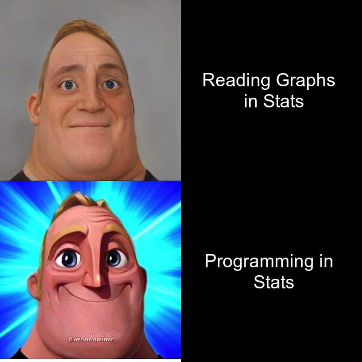

# Welcome!
This is my test website to display the **meme** I created in R.

## Meme:


I had a couple inspirations for this meme:
1. I *borrowed* the idea from a [popular meme format](https://knowyourmeme.com/memes/mr-incredible-becoming-uncanny)
2. I also used the fact that I enjoy the programming side of stats compared to the graph analysis. 

Both of these combined to produce the above meme, and also the below code:

```
library(magick)

mr_incredible_bad <- image_read("https://external-preview.redd.it/vHK-C-Wx28llvnpcqe-H3CHbjxywA347arliw31bBSM.png?format=pjpg&auto=webp&s=1597553082499b2a5fb9beb0b795f1729dcc391c") %>%
  image_scale(300)

mr_incredible_good <- image_read("https://external-preview.redd.it/Obkgcz6050K-FCRzB5laAzs2lETKfG67SD4836x98c4.png?format=pjpg&auto=webp&s=018967bfbc0aa49be8d20db145079bc3710c7a85") %>%
  image_scale(300)
top_right <- image_blank(width = 300, height = 300, color = "#000000") %>%
  image_annotate(text = "Reading Graphs \n in Stats", color = "#FFFFFF", size = 30, gravity = "center")
top_left <- image_blank(width = 300, height = 300, color = "#000000") %>%
  image_annotate(text = "Programming in \n Stats", color = "#FFFFFF", size = 30, gravity = "center")


top_row <- image_append(c(mr_incredible_bad, top_right))
bottom_row <- image_append(c(mr_incredible_good, top_left))
final_image <- image_append(c(top_row, bottom_row), stack = TRUE)

image_write(final_image, "my_meme.png")
```
